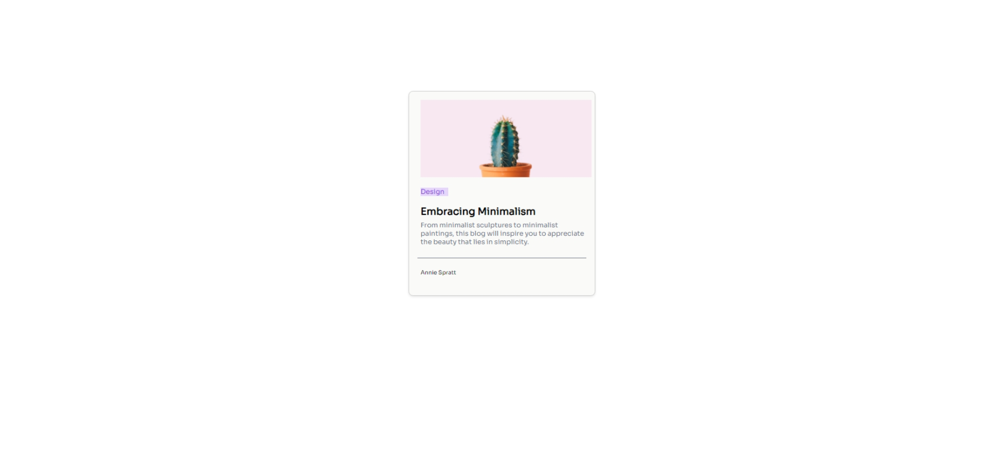

# Tarjeta Minimalista de Blog

Esta es una  tarjeta minimalista de blog es  simple y elegante. Diseñada con un enfoque en la simplicidad y el contenido, esta tarjeta agrega un toque de estilo a tu página de inicio o a las secciones de resumen de tu blog.

## Características

- **Diseño Minimalista**: La tarjeta presenta un diseño minimalista que pone el contenido en primer plano. El texto y las imágenes se destacan sin distracciones innecesarias.

- **Totalmente Personalizable**: Puedes personalizar fácilmente los colores, las fuentes y otros aspectos de la tarjeta para que se adapten a la estética de tu sitio web.

- **Información Relevante**: Incluye el título del artículo, una breve descripción y un enlace para acceder a la publicación completa.

- **Optimizada para Dispositivos Móviles**: La tarjeta está diseñada para ser responsiva y se verá bien en una variedad de dispositivos, desde computadoras de escritorio hasta smartphones.

## Cómo Integrar

Integrar esta tarjeta minimalista de blog en tu sitio web es un proceso sencillo:

1. Clona o descarga este repositorio en tu máquina local.

2. Agrega el código HTML y CSS proporcionado en tus páginas web donde desees mostrar la tarjeta de blog.

3. Asegúrate de que los estilos CSS se vinculen correctamente y de que las rutas de las imágenes sean precisas.

4. Personaliza el contenido y los estilos según las necesidades de tu sitio web.

5. Asegúrate de que los enlaces en la tarjeta dirijan a las publicaciones de tu blog.

## Cómo Contribuir

Si deseas contribuir al desarrollo de esta tarjeta minimalista de blog, no dudes en realizar un "fork" de este repositorio. Puedes enviar sugerencias, correcciones de errores o mejoras a través de "pull requests." Estamos abiertos a colaboraciones que ayuden a mejorar esta herramienta para la comunidad.

## Autor

Esta tarjeta minimalista de blog fue creada por  Juan DIego Sastre Moreno

Si tienes alguna pregunta o necesitas ayuda, no dudes en ponerte en contacto conmigo.

## Redes
- Twitter: @Diegodev10